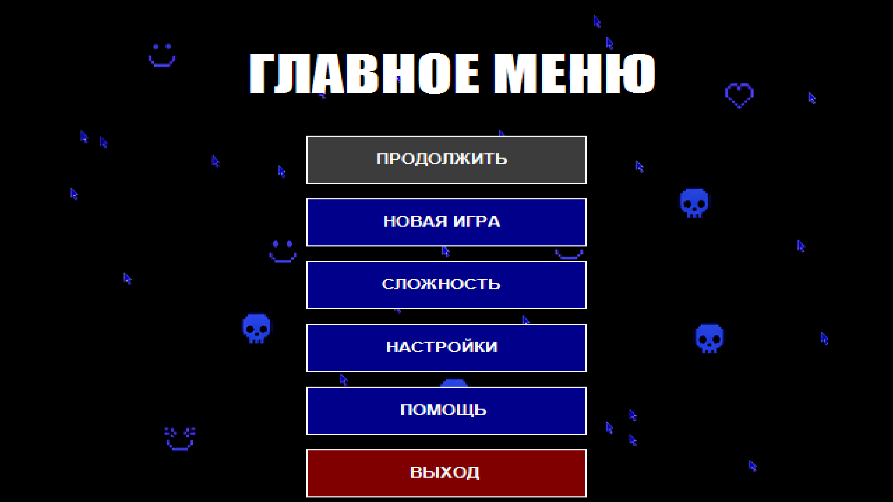
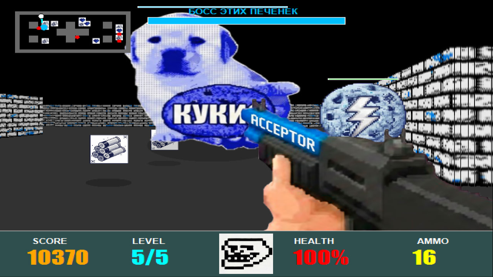
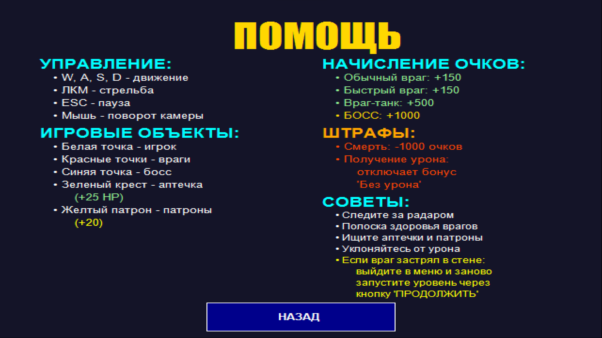
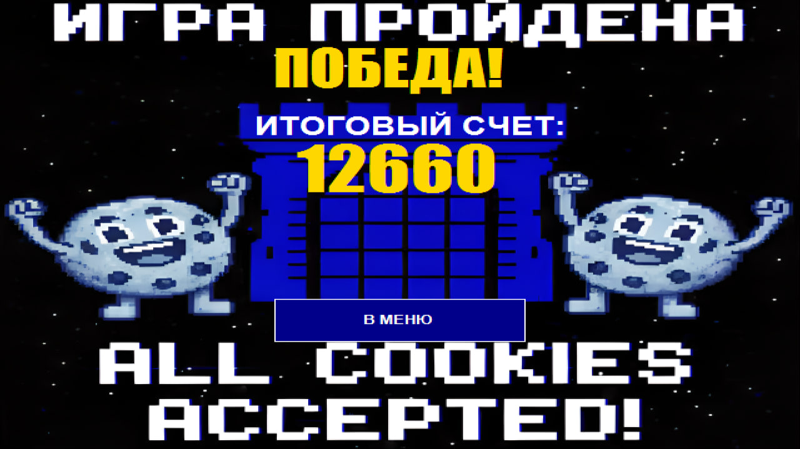

  <h1>🎮 AAC GAME - 2.5D Шутер от первого лица</h1>
  
  
  
  
  
  <h3>Классический шутер в стиле Wolfenstein 3D | 5 уровней | 4 типа врагов | Босс</h3>
  
  
  

---

## 📸 СКРИНШОТЫ

  <table>
    <tr>
      <td></td>
      <td></td>
      <td></td>
    </tr>
    <tr>
      <td align="center"><b>Главное меню</b></td>
      <td align="center"><b>Игровой процесс</b></td>
      <td align="center"><b>Битва с боссом</b></td>
    </tr>
    <tr>
      <td></td>
      <td></td>
      <td></td>
    </tr>
    <tr>
      <td align="center"><b>Экран помощи</b></td>
      <td align="center"><b>Экран победы</b></td>
      <td></td>
    </tr>
  </table>

---

## 📝 О ПРОЕКТЕ

**AAC Game** — динамичный шутер от первого лица, вдохновленный классическими играми 90-х. Игроку предстоит пройти 5 уровней, сражаясь с различными типами врагов, собирая аптечки и патроны.

### ✨ Особенности

- 🎯 **5 уникальных уровней** с возрастающей сложностью
- 👾 **4 типа врагов**: обычные, быстрые, танки и огромный босс
- 📊 **Система очков** с бонусами за скорость, точность и отсутствие урона
- 💾 **Автосохранение** при выходе в меню
- 🎚️ **3 уровня сложности** (Easy, Normal, Hard)
- 🔊 **Полное звуковое сопровождение** (музыка + эффекты)

---

## 🎮 УПРАВЛЕНИЕ

| Клавиша | Действие |
|---------|----------|
| `W`, `A`, `S`, `D` | Движение |
| `ЛКМ` | Стрельба |
| `ESC` | Пауза |
| `Мышь` | Поворот камеры |

---

## ⚙️ СИСТЕМА ОЧКОВ

| Действие | Очки |
|----------|------|
| Обычный/быстрый враг | +150 |
| Враг-танк | +500 |
| БОСС | +1000 |
| Бонус за скорость | до +500 |
| Бонус за точность | до +500 |
| Бонус "Без урона" | +1000 |
| Смерть | **-1000** |

---

## 🚀 УСТАНОВКА

1. **Скачайте архив:**  
   [⬇️ AAC_Game_v1.0.zip](https://github.com/reyjkizi/AAC_Game/releases/download/v1.0.0/AAC_Game_v1.0.zip)

2. **Распакуйте** в любую папку

3. **Запустите** `AAC_Game.exe`

> ⚠️ Важно: Не удаляйте папку `Assets` - она содержит все ресурсы игры!

### 📋 Системные требования

- **ОС:** Windows 7/8/10/11
- **.NET Framework:** 4.8 или выше
- **Место:** ~50 МБ

---

## 👨‍💻 АВТОР

**reyjkizi**

---

  ⭐ Поставьте звезду, если вам понравился проект! ⭐

